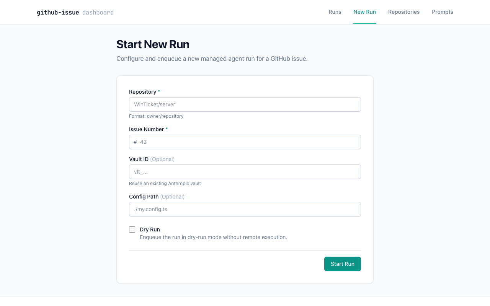
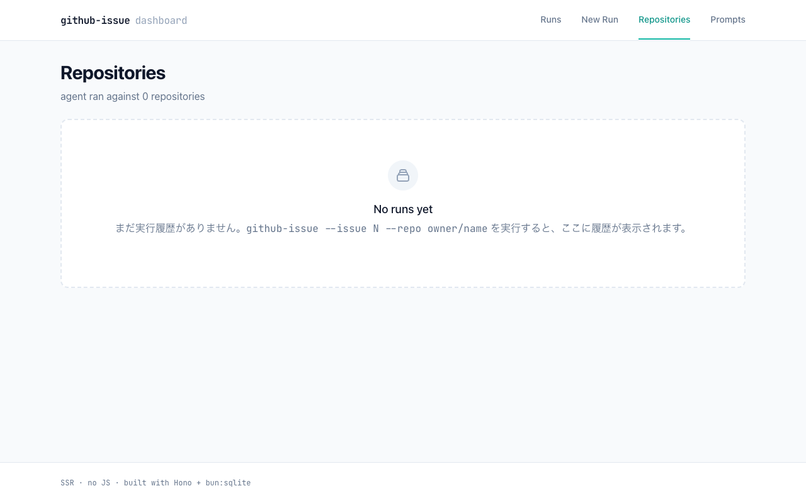

# github-issue-agent

GitHub issue を自動的に分解し、実装 PR を作成する HTTP サーバー型エージェント。
WebUI から `--issue 21925 --repo WinTicket/server` 相当を実行できる。

## 概要

`github-issue-agent` は、GitHub issue を親タスクとして受け取り、それを複数の子 issue（サブタスク）に自動分解し、最終的に 1 つのプルリクエストにまとめて実装を完了させるためのツールです。

Anthropic Managed Agents API (`@anthropic-ai/sdk`) を利用しており、エージェントが GitHub リポジトリを直接操作してタスクを遂行します。

## Quick Start

```bash
bun install
export ANTHROPIC_API_KEY=...
export GITHUB_TOKEN=...
bun run start
# → Listening on http://127.0.0.1:3000
```

ブラウザで http://127.0.0.1:3000 を開く。

## Screenshots




## Environment Variables

| Variable | Default | Description |
|---|---|---|
| `PORT` | `3000` | listen port |
| `HOST` | `127.0.0.1` | bind host (set to `0.0.0.0` to expose) |
| `DB_PATH` | `.github-issue-agent/dashboard.db` | SQLite db |
| `CONFIG_PATH` | (none) | optional config TS path |
| `ANTHROPIC_API_KEY` | (required) | Anthropic API key |
| `GITHUB_TOKEN` | (required) | GitHub PAT (`repo` for classic; `contents:read`, `issues:write`, `pull_requests:write` for fine-grained) |
| `LOG_LEVEL` | `info` | log level |
| `LOG_FILE` | stderr | log file path |

## HTTP API

### POST /api/runs
```json
{ "issue": 42, "repo": "owner/name", "dryRun": false }
```
returns `{ "runId": "uuid" }`

### GET /api/runs
returns `{ "runs": [...], "total": N }`

### GET /api/runs/:runId
returns full run detail

### POST /api/runs/:runId/stop
returns `{ "outcome": "stopped" | "..." }`

### GET /api/runs/:runId/events
Server-Sent Events stream. Supports `Last-Event-ID` for resume.
Event kinds: `phase`, `session`, `subIssue`, `log`, `complete`, `error`.

## WebUI flow

1. ブラウザで `http://127.0.0.1:3000/runs/new` を開く
2. `Issue Number` (例: `21925`)、`Repo` (例: `WinTicket/server`) を入力
3. (Optional) `Dry-run` にチェック → decomposition プランのみ計算
4. Submit → `/runs/:runId/live` に遷移、SSE でリアルタイム進捗を表示

## Prompt Management

WebUI から、エージェントの **system prompt を閲覧・編集** できます。編集された値は SQLite (`.github-issue-agent/dashboard.db`) に永続化され、次回実行時に DB から読み込まれて Anthropic 側の agent 定義に自動反映されます。

ヘッダーの **Prompts** ナビからプロンプト一覧へ遷移 (`/prompts`) して編集可能です。

## 設定

設定ファイル `github-issue-agent.config.ts` を作成することで、動作をカスタマイズできます。

```ts
import type { Config } from "./src/shared/config";

const config: Config = {
  models: { parent: "claude-opus-4-7", child: "claude-sonnet-4-6" },
  maxSubIssues: 10,
  maxRunMinutes: 120,
  maxChildMinutes: 30,
  pr: { draft: true, base: "main" },
  commitStyle: "conventional",
  git: {
    authorName: "claude-agent[bot]",
    authorEmail: "claude-agent@users.noreply.github.com",
  },
};

export default config;
```

## コスト

目安として、セッション 1 時間あたり約 `0.08 USD` のコストが発生します（2026-04 時点の `claude-opus-4-7` の session 課金に基づく）。

issue の分解からサブタスクの実装完了までの総コストは、issue の規模や生成される子タスクの数に依存します。Anthropic 側のモデル料金は変動するため、最新の価格は公式ドキュメントで確認してください。

## Deployment

Fly.io + Cloudflare Tunnel + Cloudflare Access (OIDC) のセットアップ手順は
`docs/deploy-fly.md` を参照。リポジトリには `Dockerfile` / `fly.toml` /
`scripts/start.sh` を同梱しているので、`fly launch --copy-config` ですぐ動く。

## E2E Tests

```bash
E2E=1 TEST_REPO=<owner>/<repo> TEST_ISSUE=<n> bun run scripts/e2e-real.ts
```
詳細は `docs/e2e-setup.md` を参照。

## Troubleshooting

- **ロックファイルが残った場合**: `rm .github-issue-agent/run.lock.lock`
- **WebUI に履歴が出ない**: 1 度 issue を実行して DB に書き込む必要があります
- **ポート競合**: `PORT=3097 bun run start`
